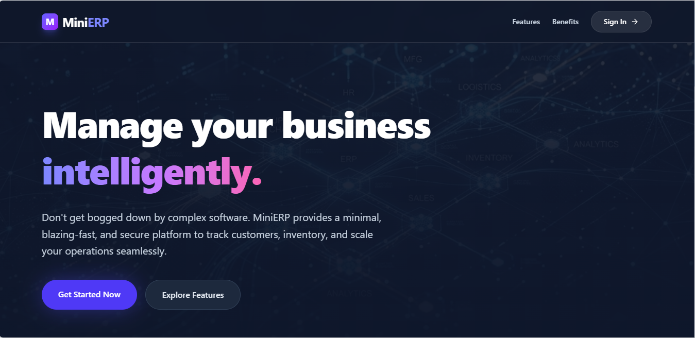
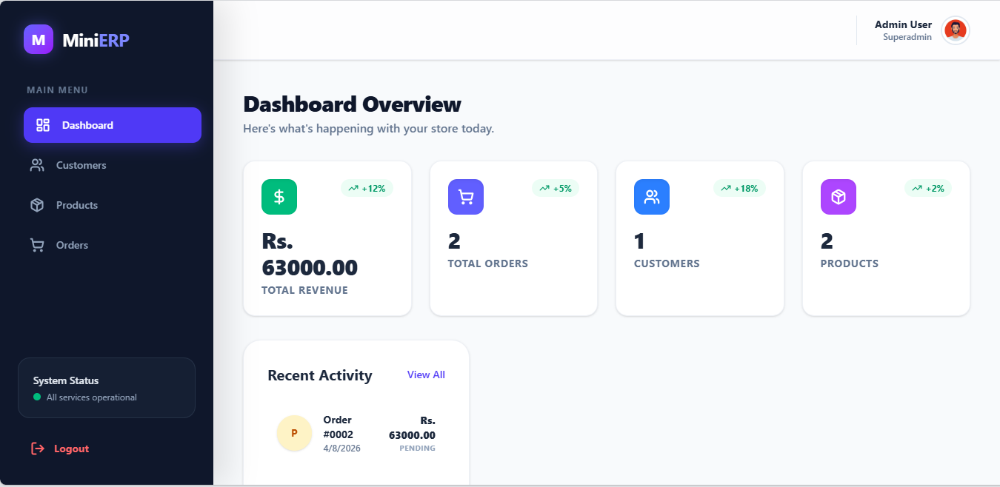
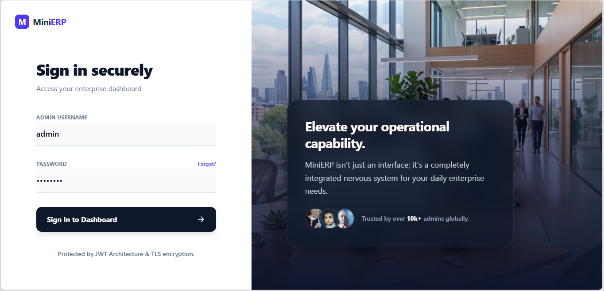
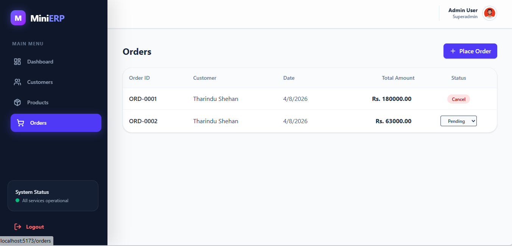
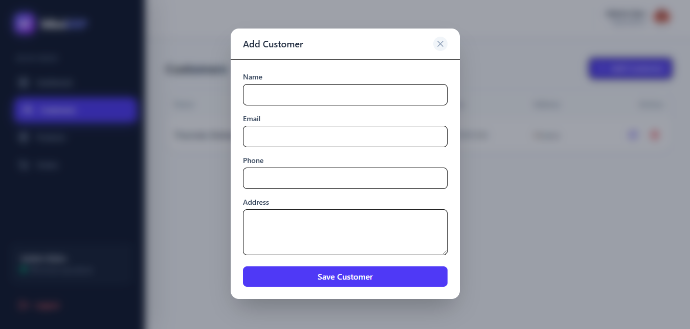

# Mini ERP System

A robust, full-stack Enterprise Resource Planning (ERP) application developed to intelligently manage your business operations including Customers, Products, and Complex Orders with automated stock management. It features a completely custom, stunning high-fidelity GUI powered by React and TailwindCSS V4, connected to a lightning-fast Golang backend.

---

## 🎨 Screenshots

### Landing Page & Dashboard Snapshot
<div class="flex flex-wrap gap-4">
  
  
</div>

### Authentication & Order Processing
<div class="flex flex-wrap gap-4">
  
  
</div>

### Customer Management 


---

## 🚀 Features

- **Stateless Authentication Engine**: Secure login using JWT Access & Refresh Tokens, stored via optimized Axios interceptors for a seamless user experience.
- **Customer & Product Mastery**: Full CRUD (Create, Read, Update, Delete) capability leveraging intuitive overlapping Modals.
- **Atomic Order Handling System**: 
  - Calculates estimated totals instantly on the client.
  - Features real-time stock-validation.
  - Automatically deducts inventory upon placing orders using *Golang DB Transactions* enforcing data integrity.
  - Refills inventory instantly if an order status is reversed to "Cancel".
- **Dynamic Dashboard**: Visualizing total revenue, aggregate product lines, real-time activity metrics. Includes AI-Generated sophisticated SaaS imagery and CSS smooth animations.
- **Glassmorphism Design Theme**: Professional UI, smooth page transitions, floating borders.

---

## 🛠️ Technology Stack

### Frontend
- **React.js 19** (Vite + TypeScript)
- **Tailwind CSS v4** for custom sleek utility-first aesthetics
- **Redux Toolkit** for predictable Authentication state management
- **Axios** for intercepting and handling server-client streams natively
- **Lucide-React** for rich icon sets

### Backend
- **Golang** (Go 1.20+)
- **Gin Framework** for highly concurrent and scalable REST APIs
- **Go-JWT** for tokenized auth logic
- **Bcrypt** for secure password hashing

### Database
- **MySQL Database**
- Connected via classic `database/sql` using generic SQL driver `go-sql-driver/mysql` ensuring atomic rollbacks.

---

## 📂 Project Structure
```bash
/Mini ERP System
 ├── Backend/              # Go application
 │   ├── config/           # Database driver config & connections
 │   ├── controllers/      # Business logic handlers (Auth, CRUD, Stocks)
 │   ├── middleware/       # Auth enforcement (Bearer token logic) & CORS Config
 │   ├── models/           # DTOs
 │   ├── routes/           # API Routing (protected & open endpoints)
 │   ├── main.go           # Server Engine (entrypoint)
 │   └── database.sql      # Database initialization DDL
 │
 ├── frontend/             # Single Page React App
 │   ├── public/           # Static generated assets (hero, feature images)
 │   ├── src/
 │       ├── components/   # Application Modals, Sidebar Layouts
 │       ├── pages/        # Main GUI layers (Dashboard, Customers, Orders...)
 │       ├── redux/        # Auth Slices & Dispatchers
 │       ├── services/     # Axios configs intercepting 401 unauth resets
 │       ├── types/        # TypeScript Definitions
 │       ├── App.tsx       # Routing table
 │       ├── index.css     # Tailwinds custom animation keys and injections
 │       └── main.tsx      # Provider bindings
 │
 ├── screenshots/          # Showcase artifacts for repo documentation
 └── README.md             # This file
```

---

## ⚙️ Installation & Setup

Before running, ensure you have **Go**, **Node.js (v18+)**, and **MySQL Server** installed.

### 1. Database Setup
1. Launch MySQL and run the script contained in `Backend/database.sql` to initialize the root structure.
    ```sql
    CREATE DATABASE IF NOT EXISTS minierp;
    -- Run content of the script
    ```
2. Configure your DB connection parameters inside `Backend/config/db.go`.

### 2. Backend Initialization
Open a bash/Powershell terminal inside the `Backend/` directory:
```bash
cd Backend
go mod tidy
go run main.go
```
The server will boot and begin listening on `http://localhost:8080`.

### 3. Frontend Initialization
Open a new terminal session inside the `frontend/` directory:
```bash
cd frontend
npm install
npm run dev
```
The client connects via `http://localhost:5173`. 

---

## 🔒 Postman / Testing Credentials

You can test Authentication functionality using the built-in system credentials. To register an initial superadmin:

**Create Admin (Via Postman or cURL):**
- **Method**: `POST`
- **URL**: `http://localhost:8080/api/register`
- **Body** (Raw JSON): 
  ```json
  {
    "username": "admin",
    "password": "admin123"
  }
  ```

Once created, log into the `/login` route using the web browser UI with `admin` and `admin123`.

---
*Developed with modern structural patterns merging lightning Go API logic and aesthetic React experiences.*
